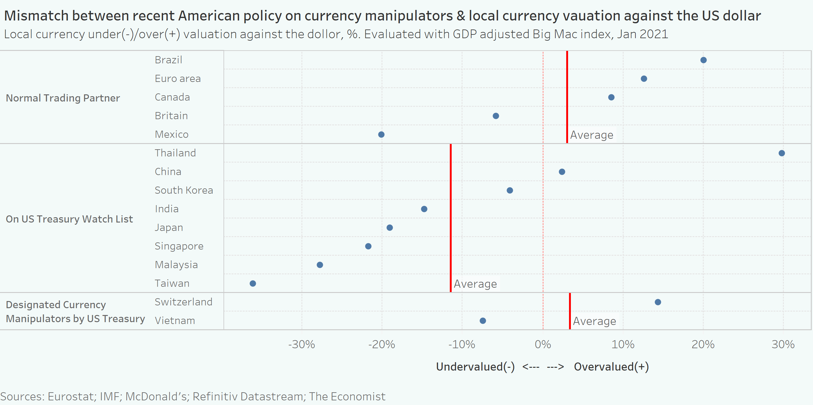

## Big Mac Index graph from the Economist

Why this data visualization?

I picked this visualization because I think this is a visualization that is very informative, accurate, and carefully thought through for most of the elements, but the main story is not clear enough to understand easily. I see this as a common real-life problem for data scientists. Most of the times, data scientists do not make obvious, major mistakes such as using a wrong type of graph, using confusing color or style. However, they often struggle to tell a clear story with one well-crafted graph. Being clear, concise and persuvasive with a graph is a more common struggle to me. That's why I picked this data visualization from the Economist. The graph itself is already a 80/100 score graph, trying to improve from 80 to 90 is more challenging than improve another graph from 60 to 80. But I would like to take up on the challenge and see if I could make the graph more concise and help the graph tell the story quicker and easier.

Source: [the Economist page](https://www.economist.com/finance-and-economics/2021/01/12/what-the-big-mac-index-tells-you-about-currency-wars) / or see in my repo big max index.pdf file

The graph is showing the local currency valuation against the dollar using big mac index, meaning that it is evaluating whether a currency is over/under valued by measuring the price of a big mac hamburgher in that country. The original graph here shows the raw local currency valuation for Jul 2020, Jan 2021 and the GDP adjusted currency valuation for Jan 2021. Based on the numbers, the graph is trying to show that there is a mismatch between American policy on currency manipulator & local currency valuation against the US dollar. Usually, people would expect the US to mark countries with undervalued currency as manipultors, but we see that Switzerland has over-valued currency and is marked as manipulator, while mexico currency is highly under-valued but is not even on watch list. So the article goes into detail and explains why is that the case.

## The process
I first critiqued the data visualization with the Stephen Few's Data Visualization Effectiveness Profile, and get the following insights that I could use for my redesign:

- The original graph is doing well in its usefulness, completeness, truthfulness, meaning that the graph is doing well at understanding who are their target readers, it is in general understandable and is accurate, reliable and valid.
- The original graph however is not doing well at its perceptibility, intuitivenss, aesthetics, engagement, meaning that even though the data visualization is trying to describe an interesting topic, the graph is not beautiful and concise enough to tell the story clearly.
- This graph understands that its primary audience would be poeple who are interested in Economics related issues. I am sure that this graph would be good enough for an Economics journal paper, where the primary readers are researches who would like to know all the details and are willing to fully understand the story by spending several minutes on the graph and 10 mins on reading the related documents. However, considering that The Economists readers would have less patience than a normal researcher. I think my improvment focus is going to be: try to keep only the information that is most revelant to the story and try ways to make the story stand out, so from there I though of some points that I could imporve on:
  1. Delete the raw big mac indexes, these are less important information. I am planning to only keep the most important GDP adjusted big mac index.
  2. Change the title, axis labels to stress the story with words
  3. add elements on the graph to give more clear categories: normal trade partners, on US treasury watch list, designated currency manipulator by US treasury.

With those thoughts in my mind, I created a wireframe skatch as following:

I still imagine my imporved visualization to be on the page of the Economist magazine. The page will be filled with a 800-words article discribing the Big Mac Index, in a three columns layout. The visualization is going to be at the bottom right corner of the page, width equal to 2 columns width. When the reader turn to this page, he/she would immediately see the visualization. And our intention would be that they will see the main point of the article through the single visualization, and they would be interested enough in this visual and the story that they decide to learn more about the related topic and begin to read the article. 

Then I showed my wireframe to two people and asked for feedback on the wireframe, here are the answers I got:

**Person 1:**

- Can you tell me what you think this is?

This is a graph.
- Can you describe to me what this is telling you?

It refelcts the mismatch between the current US policy and the actual currency valuation.
- Is there anything you find surprising or confusing?

1.What is US treasury. 2. From the grpah, it seems the policy is not very reasonable because the three cateory's currency valuation does not show significant difference.
- Who do you think is the intended audience for this?

Policymakers who make relevant policy. Or researchers who research currency manipulation.
- Is there anything you would change or do differently?

Add grid to make the points and the number they represents clearer. Consider add average line for each category.

**Person 2:**

- Can you tell me what you think this is?

This is a graph for exchange rate valuation. The line in the middle there is the baseline.
- Can you describe to me what this is telling you?

1.It tells whether the different currency is over/under valuabled. 2. On watch list, it is most undervalued. 3. Vietnam is manufacture and developing country, and its currency is undervalued.
- Is there anything you find surprising or confusing?

1.What is Big mac index. 2. How to estimate under- over value 3. the 20 40 60 not clear. 3. The categories on the right should have some explanations, the baseline countries should have category name.
- Who do you think is the intended audience for this?

Finance company, investors who do work involving exchange rate.
- Is there anything you would change or do differently?

Change to bar charts with different colors and add numbers if there is no clear grid line. 

Based on the feedback I got, I plan to make the following additional changes:
- keep the grid on visualization
- add category name to the baseline countries
- add average line to each category

## Final data visualization

The redesigned data visualizations are showing the GDP adjusted local currency valuation for countries in three different categories. With the average of currency valuations in the three categories shown with the red average lines. Readers can clearly see that both Normal trading partners and designated currency manipulators groups have overvalued local currency and do not show significant difference, with the countries on US treasury watch list have on average undervalued currency. This shows a clear mismatch between the American policy on currency manipulator and local currency valuation against the US dollar. This mismatch would make readers wonder why the mismatch happens, and thus be interested in reading the article.

I picked the side by side circle plot from Tableau, because it is a good way to compare different countries within 3 different categories. The plot type is not much different from the original plot type.

I am trying to stress on the story of the mismatch here. As a result, I have picked only the adjusted index from the original dataset, the result of the data seems less important in this case. Also, to stress on the comparsion between groups, I have plotted out the average line for each group to highlight the between group comparsion and stress the point that the data manipulator countries' currency are on average over-valued, just like the normal trading partners'.

## Summary
The **visualization was picked** becuase I think this is a visualization that is very informative, accurate, and carefully thought through for most of the elements, but the main story is not clear enough to understand easily. I see this as a common real-life problem for data scientists. Most of the times, data scientists do not make obvious, major mistakes such as using a wrong type of graph, using confusing color or style. However, they often struggle to tell a clear story with one well-crafted graph. Being clear, concise and persuvasive with a graph is a more common struggle to me. So I picked this data visualization from The Economist. The graph itself is already a 80/100 score graph, trying to improve from 80 to 90 is more challenging than improve another graph from 60 to 80. But I would like to take up on the challenge and see if I could make the graph more concise and help the graph tell the story quicker and easier.

After picking the visualization, I first **critiqued the data visualization** with the Stephen Few's Data Visualization Effectiveness Profile, and get the following insights that I could use for my redesign:

- The original graph is doing well in its usefulness, completeness, truthfulness, meaning that the graph is doing well at understanding who are their target readers, it is in general understandable and is accurate, reliable and valid.
- The original graph however is not doing well at its perceptibility, intuitivenss, aesthetics, engagement, meaning that even though the data visualization is trying to describe an interesting topic, the graph is not beautiful and concise enough to tell the story clearly.
- This graph understands that its primary audience would be poeple who are interested in Economics related issues. I am sure that this graph would be good enough for an Economics journal paper, where the primary readers are researches who would like to know all the details and are willing to fully understand the story by spending several minutes on the graph and 10 mins on reading the related documents. However, considering that The Economists readers would have less patience than a normal researcher. I think my improvment focus is going to be: try to keep only the information that is most revelant to the story and try ways to make the story stand out, so from there I though of some points that I could imporve on:
  1. Delete the raw big mac indexes, these are less important information. I am planning to only keep the most important GDP adjusted big mac index.
  2. Change the title, axis labels to stress the story with words
  3. add elements on the graph to give more clear categories: normal trade partners, on US treasury watch list, designated currency manipulator by US treasury.

With those thoughts in my mind, I **created a wireframe skatch** and **asked for insights from two other people**, and based on their feedback, I decided to do the following extra changes:

- keep the grid on visualization
- add category name to the baseline countries
- add average line to each category

Then with all the insights from the critique method and others, I **recreated the visualization**.

The redesigned visualization data visualizations are showing the GDP adjusted local currency valuation for countries in three different categories (normal, watch list, currency manipulator). With the average of currency valuations in the three categories shown with the red average lines, readers can clearly see that both Normal trading partners and designated currency manipulators groups have overvalued local currency and do not show significant difference, with the countries on US treasury watch list have on average undervalued currency. This shows a clear mismatch between the American policy on currency manipulator and local currency valuation against the US dollar. This mismatch would make readers understand the general story but at the same time wonder why the mismatch happens, and thus be interested in reading the article.

I picked the side by side circle plot from Tableau, because it is a good way to compare different countries within 3 different categories. The plot type is not much different from the original plot type. I am trying to stress on the story of the mismatch here. As a result, I have picked only the adjusted index from the original dataset, the result of the data seems less important in this case. Also, to stress on the comparsion between groups, I have plotted out the average line for each group to highlight the between group comparsion and stress on the point that the data manipulator countries' currency are on average over-valued, just like the normal trading partners'.

In general, I think the whole process of: pick visual - critique - wireframe - ask for opinion - finalize design works very well for redesigning visualizations. The constant feedback from others and the critique methods greatly improves the final outcome and makes the final graph more reader friendly.
