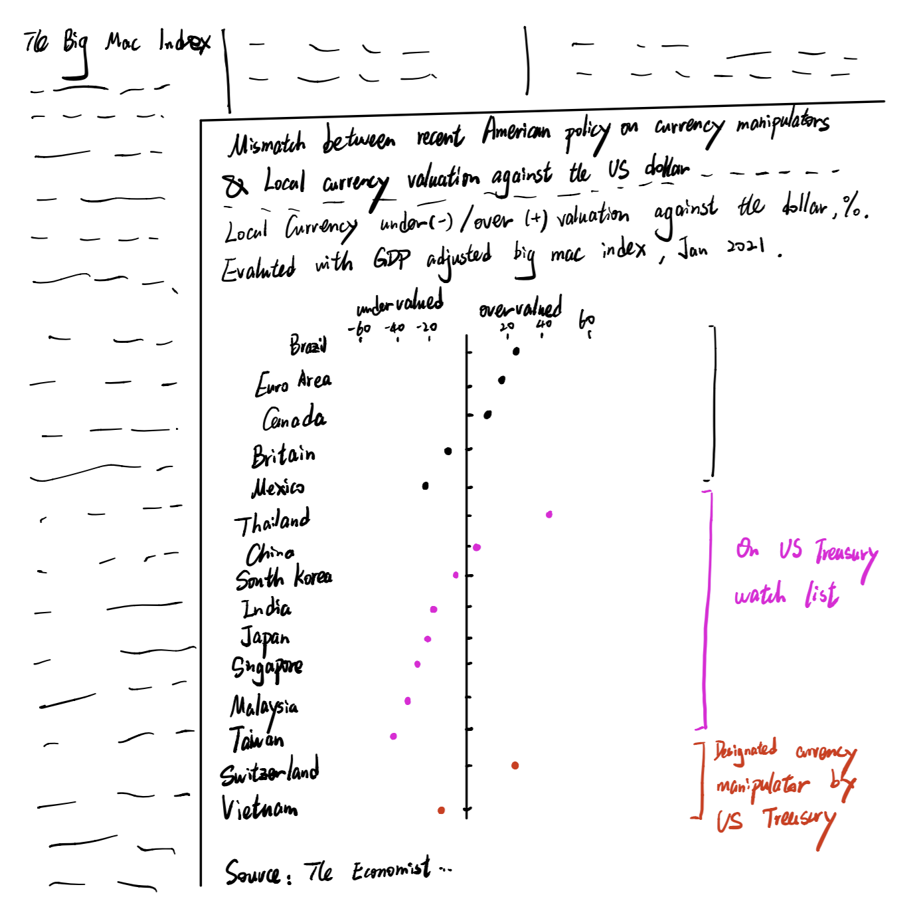

## Big Mac Index graph from the Economist

Why this data visualization?

I picked this visualization because I think this is a visualization that is very informative, accurate, and carefully thought through for most of the elements, but the main story is not clear enough to understand easily. I see this as a common real-life problem for data scientists. Most of the times, data scientists do not make obvious, major mistakes such as using a wrong type of graph, using confusing color or style. However, they often struggle to tell a clear story with one well-crafted graph. Being clear, concise and persuvasive with a graph is a more common struggle to me. That's why I picked this data visualization from the Economist. The graph itself is already a 80/100 score graph, trying to improve from 80 to 90 is more challenging than improve another graph from 60 to 80. But I would like to take up on the challenge and see if I could make the graph more concise and help the graph tell the story quicker and easier.

Source: [the Economist page](https://www.economist.com/finance-and-economics/2021/01/12/what-the-big-mac-index-tells-you-about-currency-wars) / or see in my repo big max index.pdf file

## The process
I first critiqued the data visualization with the Stephen Few's Data Visualization Effectiveness Profile, and get the following insights that I could use for my redesign:

- The original graph is doing well in its usefulness, completeness, truthfulness, meaning that the graph is doing well at understanding who are their target readers, it is in general understandable and is accurate, reliable and valid.
- The original graph however is not doing well at its perceptibility, intuitivenss, aesthetics, engagement, meaning that even though the data visualization is trying to describe an interesting topic, the graph is not beautiful and concise enough to tell the story clearly.
- This graph understands that its primary audience would be poeple who are interested in Economics related issues. I am sure that this graph would be good enough for an Economics journal paper, where the primary readers are researches who would like to know all the details and are willing to fully understand the story by spending several minutes on the graph and 10 mins on reading the related documents. However, considering that The Economists readers would have less patience than a normal researcher. I think my improvment focus is going to be: try to keep only the information that is most revelant to the story and try ways to make the story stand out, so from there I though of some points that I could imporve on:
- 1. Delete the raw big mac indexes, these are less important information. I am planning to only keep the most important GDP adjusted big mac index.
- 2. Change the title, axis labels to stress the story with words
- 3. add elements on the graph to give more clear categories: normal trade partners, on US treasury watch list, designated currency manipulator by US treasury.

With those thoughts in my mind, I created a wireframe skatch as following:

I still imagine my imporved visualization to be on the page of the Economist magazine. The page will be filled with a 800-words article discribing the Big Mac Index, in a three columns layout. The visualization is going to be at the bottom right corner of the page, width equal to 2 columns width. When the reader turn to this page, he/she would immediately see the visualization. And our intention would be that they will see the main point of the article through the single visualization, and they would be interested enough in this visual and the story that they decide to learn more about the related topic and begin to read the article. 

Then I showed my wireframe to two people and asked for feedback on the wireframe, here are the answers I got:

Person 1:
- Can you tell me what you think this is?

This is a graph.
- Can you describe to me what this is telling you?

It refelcts the mismatch between the current US policy and the actual currency valuation.
- Is there anything you find surprising or confusing?

1.What is US treasury. 2. From the grpah, it seems the policy is not very reasonable because the three cateory's currency valuation does not show significant difference.
- Who do you think is the intended audience for this?

Policymakers who make relevant policy. Or researchers who research currency manipulation.
- Is there anything you would change or do differently?

Add grid to make the points and the number they represents clearer. Consider add average line for each category.

Person 2:
- Can you tell me what you think this is?

This is a graph for exchange rate valuation. The line in the middle there is the baseline.
- Can you describe to me what this is telling you?

1.It tells whether the different currency is over/under valuabled. 2. On watch list, it is most undervalued. 3. Vietnam is manufacture and developing country, and its currency is undervalued.
- Is there anything you find surprising or confusing?

1.What is Big mac index. 2. How to estimate under- over value 3. the 20 40 60 not clear. 3. The categories on the right should have some explanations, the baseline countries should have category name.
- Who do you think is the intended audience for this?

Finance company, investors who do work involving exchange rate.
- Is there anything you would change or do differently?

Change to bar charts with different colors and add numbers (the numbers will show in interactive map when click). 

Based on the feedback I got, I plan to make the following additional changes:
- keep the grid on visualization
- add category name to the baseline countries
- add average line to each category

## Final data visualization

<noscript></noscript><object class='tableauViz'  style='display:none;'><param name='host_url' value='https%3A%2F%2Fpublic.tableau.com%2F' /> <param name='embed_code_version' value='3' /> <param name='site_root' value='' /><param name='name' value='bigmacindex_16139387840200&#47;Sheet1' /><param name='tabs' value='no' /><param name='toolbar' value='yes' /><param name='static_image' value='https:&#47;&#47;public.tableau.com&#47;static&#47;images&#47;bi&#47;bigmacindex_16139387840200&#47;Sheet1&#47;1.png' /> <param name='animate_transition' value='yes' /><param name='display_static_image' value='yes' /><param name='display_spinner' value='yes' /><param name='display_overlay' value='yes' /><param name='display_count' value='yes' /><param name='language' value='en' /></object>
                
