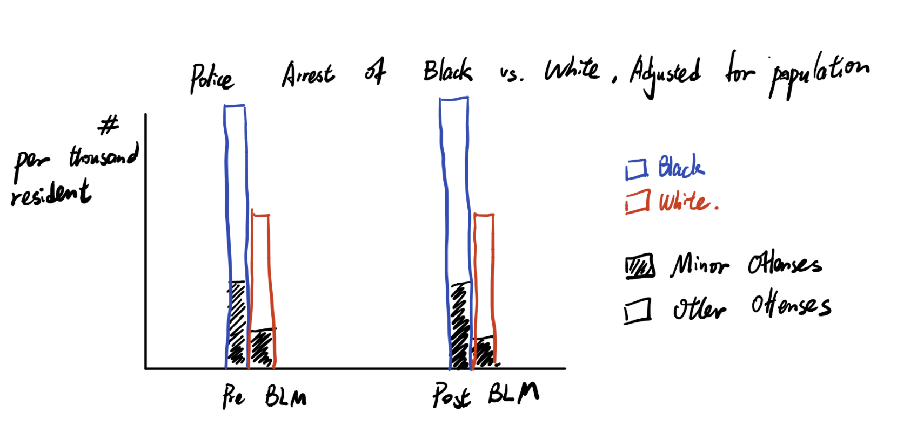
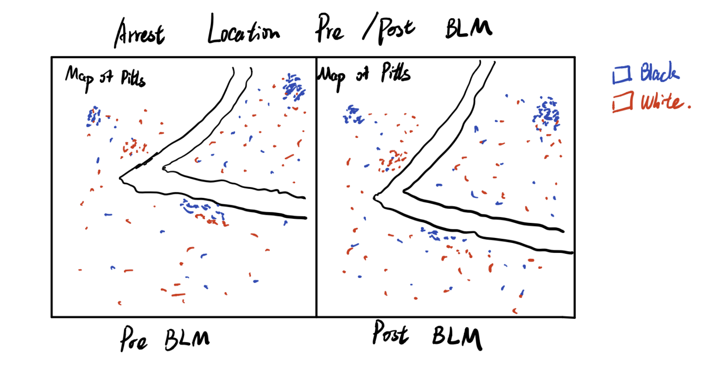

## Final Project Part I

### Outline

The project is trying to visualize arrest data in the Pittsburgh area to see if the data shows pattern of police discrimination against the african america community. Also, the project will look at pattern of police arrests over time, pre and post BLM movement to see if the BLM movement causes significant change of police arrest behavior.

Project structure:
- The background and relevant discussion of police injustice against the black community. A brief introduction about the BLM movement and its timeline in Pittsburgh area.
- Introduction of the Pitts arrest dataset
- Statistical visuals to show if there are signs of discrimination against the black community (especially from arrests for minor offenses), and do a comparsion of the stats before and after BLM to see if the situation change after BLM. 
- Map out the places of the arrest, colored by race (Black or White) to observe if there are clusterings of arrest of one race, and see if the clusterings show a change after BLM.
- Conclusion of findings & call for action(maybe).

### Initial Sketches
For the statistical visualizations part, I am currently imaging stacked bar charts to do a comparsion between the number of arrest of Black and White before and post BLM, adjusted for the population of the race. Also, the bars would be a stacked bar with each bar consisting of arrests for minor charges and arrests for other reasons because higher proportion of arrests for minor charges could potentially indicate police injustice behavior. My current hypothesis is that the graph will show the police arrests more black people and a higher propotion of them are arrested for minor charges, which means possible injustice; my another hypothesis is that the situation does not change much after the BLM movement. The exact findings awaits confirmation, but I am planning to do charts look like the following:

For the maps part, I am planning to visually see if there are clustering of arrests of one race, and if that clustering changes after BLM, so I am planning to do charts look like the following:

As said before, my current hypothesis is that the story is going to be: there is evidence suggesting potential police discrimination against the black community, and the police behavior doesn't change much post BLM.

### Data

The primary data is public data released by City of Pittburgh. [Data Source](https://data.wprdc.org/dataset/arrest-data?utm_campaign=Pittsburgh%20News&utm_source=hs_email&utm_medium=email&_hsenc=p2ANqtz-9BN2I6Nm8g8AY3cDuchW_Y_KtEeMW4ncJecwVtfAaoX9IuGepIIdTDmmqjTGCA4jwDWCvF)
The data is stored in csv format, and contains more than 40,000 arrest record from 2016 to 2021 (still updating). In the dataset, each row is an arrest record, and the record contains the following information that I could use: (arrested person's) Age, Race, Gender, ArrestTime, ArrestLocation, TypeOfOffenses. 

Currently, as descirbed in the sketch part above, I am planning to use the data in the following ways: 1) do the stacked bar chart statistical visualization 2) do the comparsion map of the arrests in the Pittsburgh area pre and post BLM.

Due to the large amount of arrest data we have, I am planning to select two months, one to represent the pre-BLM period and one to represent post-BLM period for our comparsion analysis. For example, select Dec 2019 to represent pre BLM, Dec 2020 to represent post BLM. By selecting Dec for both years, it will get rid of the seasonal influence. However, the influence of COVID could not be fully offset. But I think Dec 2020 would be the best choice I could get for the post BLM period, becuase it is almost 1 year after the COVID breakout, so people's behavior should be pretty similar to pre COVID, and thus I think selecting to compare between Dec 2019 and Dec 2020 would be ideal, not perfect without influence of COVID, but the best I could get.

### Method and medium
  
I am planning to complete the project story and presentation mainly on the shorthand platform. 

I will first see if I need to do some pre-processing data cleaning. If needed, then I would use Python or excel to pre-clean the data files.

The visualizations would be made primarily in Tableau, maybe in Flourish as well, and we will get the embed code for the visuals after the visuals are done.

The presentation would be made on the shorthand platform. The embed code for the visuals would be placed in the shorthand desk to combine the visuals into the persentation.

[Return to main page](/README.md)
