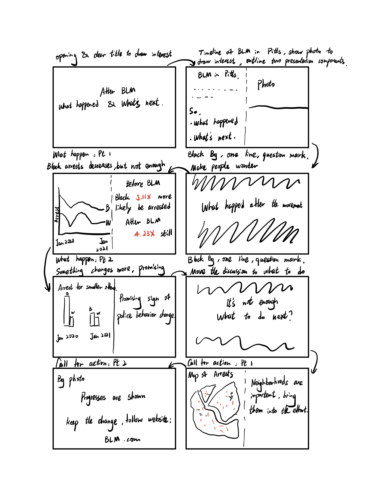

## Final Project Part II

### Wireframe: a shorthand desk
To better do user research, I built out a draft of my story in Shorthand to serve as Wireframe. 

The visualizations in the shorthand desks are generated with python codes, so they will serve as sketches for my future presentation visuals, and should be able to convey the ideas that I want to show. Those current visualizations will eventually be replaced with a final and more well-structured version made through Tableau.

The page and layouts are not final as well, but the shorthand desk should be able to show the general story line and serve as a wireframe for user research.

### StoryBoard: a general flow of the element outline

### User Research Protocol

#### Target Audience
The target audience of the presentation should be people who are interested in social problems, racial equality and BLM. This presentation would be perticularly interesting to people who are interested in using quantiative method results for improvement of social problems.

#### Approach to identify representative individuals to interview
As a student in Heinz college, many of my friends are interested in poblic policy and pushing for social problem changes. So I would just identify some of my friends who take an interest in the related topics for the interview.

#### Goals/Questions 

| Goals  | Questions |
| ------------- | ------------- |
| Evaluate the overall story line  | Do people correctly get what the presentation is showing after a quick walkthorugh? |
| Evaluate the call for action  | Do people understand what the presentation is asking the viewer to do? Do they feel motivated to take action?  |
| Evaluate the general logic flow of the presentation  | Is the general logic of the presentation easy to follow?  |
| Evaluate the visualization presented  | Is the visulations shown easy to understand?  |
| Priortize what to fix  | What problems are most severe?  |

#### Interview Sctipts

**Brief Introduction:**
Thanks for helping with my user research today. My goal today is to get feedback on a wireframe I designed for the Tell-story-With-Data class at CMU. I'm going to present you the wireframe I have, and ask you for your comments on the different components of the wireframe to see what makes senses and what's confusing. I'm trying to test the clearity of my wireframe and try to improve it, so there are no wrong answers for you! The whole process should take less than 10 mins of your time, thanks again! Now let's get started.

**Main Section**
Today I will present my wireframe about <After BLM, what happened and what's next>. I will go through the wireframe quickly, approximately 2 mins, and then ask for questions:
1. 'Okay, first of all, could you tell me what is your main takeaway from the presentation?'
2. 'Who do you think this presentation is for?'
3. 'What do you think this presentation is calling for?'
4. 'Do you feel motivated to act?'
5. 'Do you find the general logic flow of the presentation easy to follow?'
6. 'Do you think the visualization is easy to understand?'
7. 'Do you spot anything that should be changed?'

**Wrap up**

Thank you so much for your time. Do you have any questions for me?

#### Interviews Findings
  
| Questions  | Interview 1  | Interview 2 | Interview 3  |
| ------------- | ------------- | ------------- | ------------- |
| Could you tell me what is your main takeaway from the presentation?  | Pittsburgh arrest has become more fair after BLM, but still inequality exists.  | The general logic line: 1. raise the question BLM; 2. a statistic compare and see a slight deline in general but significant for some specific arrest; 3. mentioned some neighborhoods that need some more attention  | The movement makes some changes but not enough.  |
| Who do you think this presentation is for?  | Every citizen. everyone should put effort into a more equal society.  | Government & Protester  | Probably BLM advocates  |
| What do you think this presentation is calling for?  | Keep involved in the BLM, still need to push for equality. The thing we could do includes community work  | Advocate people to follow BLM, not sure ask them to protest or pay attention. Give recommendation not just protest, but other ways.  | Asking us to follow the website. Not entirely sure how to engage in local comunmunity work.  |
| Do you feel motivated to act?  | On a certain level yes.  | Not so much, if more interested in this topic   | Somwhat yes. If there are easier and more meaningful call for action, then I would be more motivated  |
| Do you find the general logic flow of the presentation easy to follow?  | In general yes. But for the data, you only shows total arrest and arrest for marijuana, no percentage. It will be more logical to show how many percentage of total arrest is due to each kind of offense, add two pie chart in the end of slide 4 to connect to slide 5.  | Yes  | Yes  |
| Do you think the visualization is easy to understand?  | Yes.  | The others is fine. Map is a little small, the points are small.  | Yes, although the color is not constant for the map the graph eariler. In the map, the points are black/red; eariler it is red/blue.  |
| Do you spot anything that should be changed?  | As mentioned above, add two pie charts.  | Page 5 is quick, and only this offense is a little thin, some other examples to make the point strong.  | As mentioned above, change to a constant color choice for Black/White statistics. Maybe consider some other call for action.  |

All three intreviewees are graduate school students, so the audience may not be super representative of the whole potential audience.

#### Changes to make
1. Add bart charts to show the type of offense people get arrested for.

[Return to main page](/README.md)
